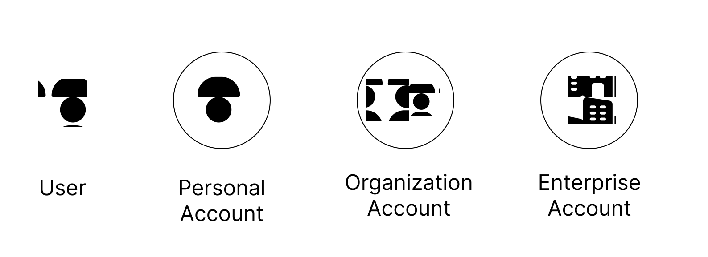

Everything in BetterMenu start with a notion of an **Account**. When a **User** signs up, they are assigned an account. An account in BetterMenu is of following types:

- **Personal Account**: A personal account is an account that represents a single user. This is the _default_ account type that a user gets when they sign up. A user may have multiple personal accounts. However, it is best to have a single personal account so that all the data is in one place.
- **Organization Account**: An organization account is an account that represents a group of users. Users can create an organization account and invite other users to join the organization account. Users can be part of multiple organizations.
- **Enterprise Account**: An enterprise account is an account that represents a company or an enterprise. An enterprise account is a special type of organization account that has additional features and capabilities.

Any activity performed in BetterMenu is associated with an account. This includes creating recipes, dishes, collections, sharing etc. Each account has a role associated with it. The role defines what actions an account can perform. The role is associated with a set of permissions that define what actions an account can perform.

## Roles
Roles are a set of rules that define what actions an account can perform. These are high-level rules that define what actions an account can perform inside BetterMenu. Some of the examples of roles are:

| Role | Description |
|------|-------------|
| Owner | The owner is the primary account holder. The owner has full control over the account and can perform any action. |
| Member | A member is a user who is part of an organization account. A member has limited control over the account and can perform only certain actions. |

Some of the key points to note about roles are:
- When a user signs up on BetterMenu, they get a **Personal Account** with the role of **Owner**. This role allows them to perform any action in the account. 
- When a user creates an **Organization Account**, they become the **Owner** of the organization account. They can then invite other users to join the organization account. The invited users become **Members** of the organization account.

## Permissions
Permissions are a set of rules that define what actions an account can perform. These are fine-grained rules that define what actions an account can perform inside BetterMenu. Some of the examples of permissions are:

| Permission | Description |
|------------|-------------|
| Create Recipe | Allows the account to create a new recipe. |
| Edit Recipe | Allows the account to edit an existing recipe. |
| Delete Recipe | Allows the account to delete a recipe. |
| Share Recipe | Allows the account to share a recipe. |
| Create Dish | Allows the account to create a new dish. |
| Update Brand Preferences | Allows the account to update the brand preferences. |
| Create Custom Ingredient | Allows the account to create a custom ingredient. |

Please note that this is a subset of the permissions that an account can have and not a comprehensive list.

